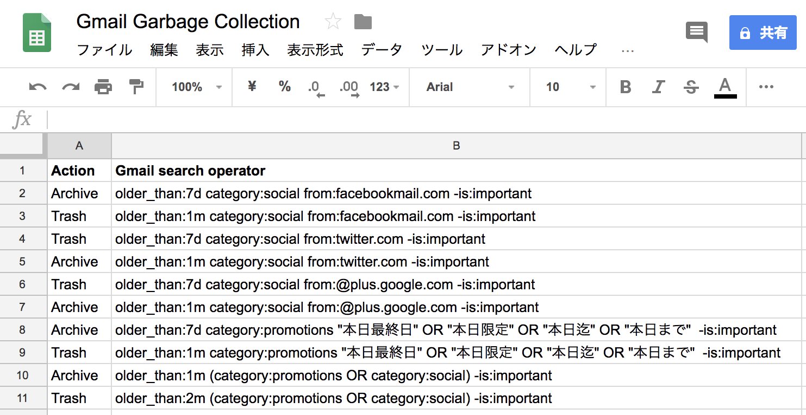
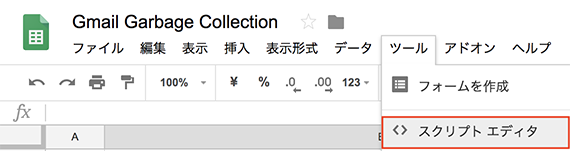
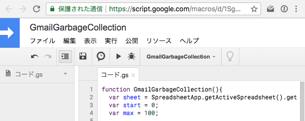
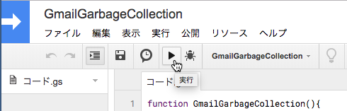
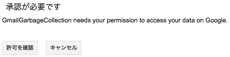
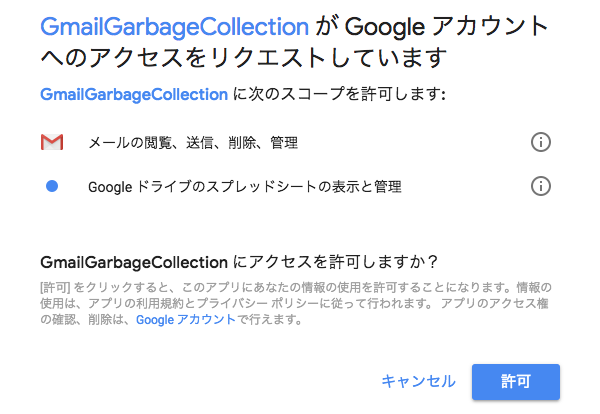
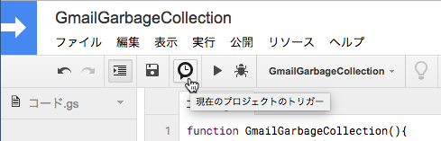
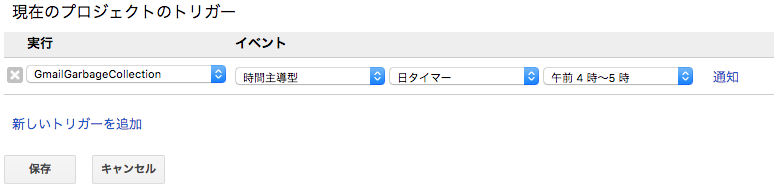

# Gmail Garbage Collection

Gmailのメールボックスの掃除を自動化したいと思ったことありませんか？
- いろんなシステムからの通知メールは受信した当日や翌日あたりまでは便利だけどその後は必要なくなるメールじゃないですか？
- Facebookのコメント通知，Twitterのメンション，Google+やその他SNSからの通知メールって古くなると邪魔じゃなだけじゃないですか？本日限定の販促メール。数日も経つと役立たずのゴミになりませんか？
- たとえメールボックス容量無制限であっても過去のメールを探そうとしたら通知メールとかシステムメールとかが無駄に引っかり探したいメールが探せなかったという経験はありませんか？

そんな賞味期限の短いメールが放置されチリツモと化しいつしかメールボックスを蝕み圧迫していたりしませんか？そんなお悩みをGmail Garbage Collectionが夜な夜な動き自動で掃除します（ただし無保証）。

# Overview

あらかじめGoogleスプレッドシートに用意した検索キーワードと動作ルールを用意し，Google Apps Scriptの時間起動により実際のメールボックスを整理します。Archiveならばアーカイブ，Trashならばゴミ箱へ移動します。Gmailの仕様ではゴミ箱に移したメールは30日後に本当に削除しますのでご注意ください。

# How to install

## Open Google Spread Sheet 

Googleスプレッドシートの2行目以降のA列にアクション（Action）をB列にGmail検索演算子（search operator）を列挙する。Actionはアーカイブ（Archive）とゴミ箱（Trash）がある。Gmail検索演算子には抽出条件を記入する。

| Action  | Gmail search operator                                                         |
|:--------|:------------------------------------------------------------------------------|
| Archive | older_than:7d category:social from:facebookmail.com -is:important -is:sterred |

- 簡単な説明

検索条件「7日（1週間）経過したFacebookからの通知メール」を探し，アクション「アーカイブ」する。
<dl>
  <dt>older_than:7d</dt>
  <dd>7日経過したメール。1mは1ヶ月。1yだと1年。
  <dt>category:social</dt>
  <dd>ソーシャル（SNS系）メール。プロモーション（販促系）なら「category:promotions」。
  <dt>from:facebookmail.com</dt>
  <dd>送信元がFacebookからの通知メール。
  <dt>-is:important</dt>
  <dd>重要なメールを除外。「-」記号が除外を意味する。スター付きメールを除外するならば「-is:starred」。</dd>
</dl>
  
- 詳しい説明

[Gmailで使用できる検索演算子](https://support.google.com/mail/answer/7190?hl=ja)

## Open Script Editor

## COPY and PASTE

## Save and Run

## Confirm

## Permit

## Trigger

## Cron

# Limitations

GmailApp.moveThreadsToXxxx（）は仕様上一度に100スレッドまでしか処理できません。メールが沢山ある方は毎日動かしているうちに解消するかもしれません。1日1回の起動では不足な場合は毎時動かすなどの調整をしてみてください。

# NO WARRANTY

完全無保証
