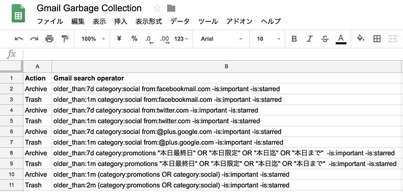
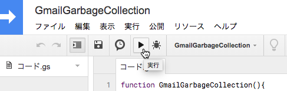

# Gmail Garbage Collection

Gmailのメールボックスの整理を自動化したいと思ったことありませんか？いろんなシステムからの通知メールはそのときは便利だけど放っておくとチリツモとなりいつしかメールボックスを圧迫していたりしませんか？たとえ容量無制限であっても過去のメールを探そうと検索したら通知メールとかシステムメールとかが無駄に引っかり探したいメールが探せなかったという経験はありませんか？Facebookのコメント通知，Twitterのメンション，Google+やその他SNSからの通知メールって古くなると邪魔じゃなだけじゃないですか？本日限定の販促メール。数日も経つと役立たずのゴミになりませんか？そんなメールがあなたのメールボックスを蝕んでいませんか？そんなお悩みをGmail Garbage Collectionが綺麗さっぱりお掃除します（ただし無保証）。

# Overview

動作原理はあらかじめGoogleスプレッドシートに用意した検索キーワードと動作ルールを用意し，Google Apps Scriptの時間起動により実際のメールボックスを整理します。Archiveならばアーカイブ，Trashならばゴミ箱へ移動します。Gmailの仕様ではゴミ箱に移したメールは30日後に本当に削除しますのでご注意ください。

# How to install

## Open Google Spread Sheet 

| Action  | Gmail search operator                                              |
|:--------|:-------------------------------------------------------------------|
| Archive | older_than:7d category:social from:facebookmail.com -is:important |
| Trash   | older_than:1m category:social from:facebookmail.com -is:important |
| Trash   | older_than:7d category:social from:twitter.com -is:important |
| Archive | older_than:1m category:social from:twitter.com -is:important |
| Trash   | older_than:7d category:social from:@plus.google.com -is:important |
| Archive | older_than:1m category:social from:@plus.google.com -is:important |

- 簡単な説明

検索条件「7日（1週間）経過したFacebookからの通知メール」を探し，アクション「アーカイブ」する。
<dl>
  <dt>older_than:7d</dt>
  <dd>7日経過したメール。1mは1ヶ月。1yだと1年。
</dl>
<dl>
  <dt>category:social</dt>
  <dd>ソーシャル（SNS系）メール。販促系ならcategory:promotion。
</dl>
<dl>
  <dt>from:facebookmail.com</dt>
  <dd>Facebookからの通知メール。
</dl>
<dl>
  <dt>-is:important</dt>
  <dd>重要なメールを除外。「-」記号が除外を意味する</dd>
</dl>
  
- 詳しい説明：[Gmailで使用できる検索演算子](https://support.google.com/mail/answer/7190?hl=ja)

## Open Script Editor

## COPY and PASTE

## Save and Run

## Confirm

## Permit

## Trigger

## Cron

# Limitations

GmailApp.moveThreadsToXxxx（）は仕様上一度に100スレッドまでしか処理できません。メールが沢山ある方は毎日動かしているうちに解消するかもしれません。1日1回の起動では不足な場合は毎時動かすなどの調整をしてみてください。

# NO WARRANTY

無保証。
